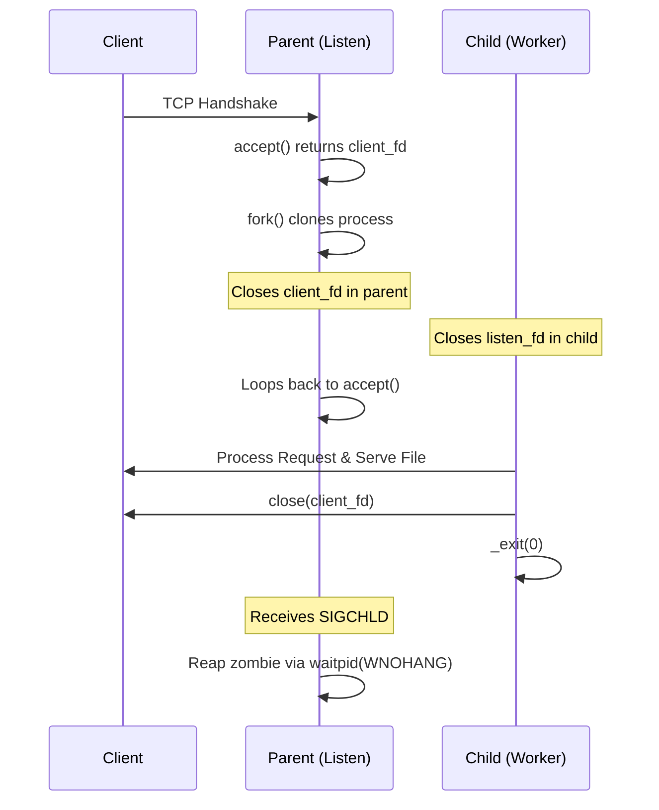

# HTTP Server Evolution: Version 3 (Multi-Process Concurrency)

This document covers the implementation details, systems programming paradigms, and interview talking points for the **Multi-Process (Fork-Based) HTTP Server** (v3). It focuses on low-level POSIX process lifecycles, signal management, and concurrency trade-offs.

---

## 1. Architectural Overview & System Call Flow

In Version 3, the server transitions from a single-connection blocking server to a concurrent architecture using **process cloning** via `fork()`. When a new TCP connection is established, the parent process clones its address space. The child process blockingly executes the HTTP handler, while the parent process immediately resumes listening for incoming client requests.



---

## 2. Key Code Implementation & Explanations

### A. The Core Accept-Fork Concurrency Loop (`src/main.c`)
```c
while (1) {
    int client_fd = server_accept(server);
    if (client_fd < 0) {
        // If accept is interrupted by the SIGCHLD signal handler, retry accept
        if (errno == EINTR) {
            continue;
        }
        perror("accept");
        continue;
    }
    
    pid_t pid = fork();
    if (pid < 0) {
        perror("fork");
        close(client_fd);
        continue;
    } else if (pid == 0) {
        // --- CHILD PROCESS ---
        // Close copy of the listening socket to prevent descriptor leaks
        server_close_listener(server);
        
        // Execute blocking HTTP parsing, file streaming, and network write
        http_handle(client_fd);
        
        // Close the client descriptor and terminate immediately
        close(client_fd);
        _exit(0); 
    } else {
        // --- PARENT PROCESS ---
        // Close copy of client socket; the child process is now responsible for it
        close(client_fd);
    }
}
```

### B. Signal Registration and Asynchronous Zombie Reaping (`src/main.c`)
```c
// Using sigaction instead of signal() for reliable POSIX behavior
struct sigaction sa;
sa.sa_handler = handle_sigchld;
sigemptyset(&sa.sa_mask);
sa.sa_flags = SA_RESTART; // Or without SA_RESTART to force EINTR handling
if (sigaction(SIGCHLD, &sa, NULL) == -1) {
    perror("sigaction");
    return 1;
}

static void handle_sigchld(int signal) {
    (void)signal;
    int saved_errno = errno; // Preserve errno to avoid corrupting interrupted system calls
    
    // Reap all terminated child processes to prevent kernel table exhaustion.
    // WNOHANG guarantees we return immediately if no child has exited.
    while (waitpid(-1, NULL, WNOHANG) > 0) {
        // Loop runs until all terminated child processes are reaped
    }
    
    errno = saved_errno; // Restore errno before returning
}
```

---

## 3. Core Concepts & Low-Level Mechanics

### A. The Mechanics of `fork()` and Copy-on-Write (COW)
When `fork()` is called, the kernel creates a new process descriptor (`task_struct`) and duplicates the parent's page tables. To minimize overhead, the kernel uses **Copy-on-Write (COW)**: physical memory pages are shared between parent and child and marked read-only. A physical copy of a page is made only when either process attempts to write to it. This delays allocation until necessary, but can introduce latency spikes during the first page write due to minor page faults.

### B. File Descriptor Reference Counting
File descriptors are indices into a process-private descriptor table pointing to entries in the system-wide open file table. When a process forks, the child inherits a copy of the parent's table, which increments the reference count of the underlying file descriptions in the open file table by 1. The socket remains open until its reference count drops to 0.

### C. Signal Safety and Re-entrancy
A signal handler can interrupt the normal execution flow at any point. Therefore, only **async-signal-safe** functions may be called within a signal handler. Functions like `printf()` or `malloc()` maintain internal mutexes or static buffers, meaning calling them in a signal handler while the main thread holds those locks can lead to deadlocks. `waitpid()` is async-signal-safe, but standard logs or terminal outputs should never be placed in `handle_sigchld`.

---

## 4. System Call Trace Analysis (`strace`)

An `strace -f -e trace=process,network,desc` execution trace reveals the kernel-level behavior:
1. `socket(AF_INET, SOCK_STREAM, 0) = 3` (Creates listen socket)
2. `bind(3, ...) = 0` and `listen(3, 128) = 0` (Binds and starts listening)
3. `accept(3, {sa_family=AF_INET, sin_port=..., sin_addr=...}, [16]) = 4` (Blocks, then returns `client_fd` 4)
4. `clone(...) = 5231` (Spawns child process PID 5231)
5. `[Parent] close(4)` (Parent releases connection reference count)
6. `[Child 5231] close(3)` (Child releases listener reference count)
7. `[Child 5231] recv(4, "GET / HTTP/1.1...", 4096, 0) = 45` (Reads HTTP request)
8. `[Child 5231] open("www/index.html", O_RDONLY) = 3` (Opens file; fd 3 is recycled)
9. `[Child 5231] send(4, "HTTP/1.1 200 OK...", ...) = 142` (Sends headers)
10. `[Child 5231] read(3, "<html>...", 4096) = 250` (Reads file content)
11. `[Child 5231] send(4, "<html>...", 250) = 250` (Sends file content)
12. `[Child 5231] close(3)` and `close(4)` (Closes file and connection)
13. `[Child 5231] exit_group(0)` (Child terminates)
14. `[Parent] --- SIGCHLD {si_signo=SIGCHLD, si_code=CLD_EXITED, si_pid=5231, ...} ---` (Parent gets signal)
15. `[Parent] wait4(-1, NULL, WNOHANG, NULL) = 5231` (Parent reaps worker zombie)

---

## 5. Key Systems Interview Questions & Answers

### Q1: Why must the child close the listener socket, and the parent close the client socket?
**Answer:**
* **Child closing listener:** The child has no need to accept new connections. Leaving the listener open exposes it to accidental reads/writes, leaks a file descriptor, and keeps the listener active even if the parent crashes.
* **Parent closing client:** If the parent doesn't close `client_fd`, the socket's reference count in the kernel remains at least 1 (held by the parent). Even when the child processes the request, closes its `client_fd`, and exits, the TCP connection will **not close** because the parent still holds an open reference. This causes resources to leak and clients to hang indefinitely.

### Q2: What is a zombie process, and how does the `SIGCHLD` handler address it?
**Answer:**
* A **zombie** is a process that has completed execution (via `exit`) but still has an entry in the process table to allow the parent to read its exit status.
* When a child exits, the kernel sends a `SIGCHLD` signal to the parent.
* If the parent ignores `SIGCHLD` and does not call `wait()` / `waitpid()`, the process table entry remains allocated. A buildup of zombies can exhaust the system's PID space, preventing new processes from starting.
* We register a handler for `SIGCHLD` that loops on `waitpid(-1, NULL, WNOHANG)`. The `WNOHANG` flag is critical: it prevents the handler from blocking if there are children that are still running. We loop because multiple child processes can terminate simultaneously, but Unix signals are not queued; a loop guarantees we reap all terminated children in a single signal invocation.

### Q3: Why do we use `_exit(0)` instead of `exit(0)` in the child process?
**Answer:**
* `exit()` is a library call that performs user-space cleanup: it flushes all open standard I/O streams (like `stdout`, `stderr`), calls functions registered with `atexit()`, and then invokes the system call `_exit()`.
* `_exit()` is a direct system call that terminates the process immediately, releasing kernel resources (file descriptors, memory maps) without flushing user-space buffers.
* Because the child process inherited duplicates of the parent's stdio buffers, calling `exit()` in the child could result in double-flushing stdout/stderr buffers, leading to duplicate output in logs or parent streams. Using `_exit(0)` guarantees clean termination.

### Q4: Explain the `EINTR` error in `accept()`. How does our code handle it?
**Answer:**
* If a process is blocked in a slow system call (like `accept()`, `read()`, or `select()`) and a signal (like `SIGCHLD`) is caught and handled, the system call is interrupted.
* The system call returns `-1` and sets `errno = EINTR`.
* If we do not handle this, the server would crash or exit its loop. We check `if (errno == EINTR)` and execute `continue` to restart the `accept()` system call, allowing the server to resume normal operation.

### Q5: Why do we preserve `errno` inside the signal handler?
**Answer:**
* If a signal is caught while the main program is executing a system call that modifies `errno` (e.g., a failing write), and the signal handler itself makes a call that fails or alters `errno` (like a successful `waitpid`), the main program's value of `errno` will be corrupted upon returning from the signal handler. Saving and restoring `errno` guarantees signal handlers do not cause unpredictable failures in the main thread.

---

## 6. Memory Leak Tools & Process Isolation

* **Valgrind and Fork:** Tools like Valgrind require passing `--trace-children=yes` to follow execution into child processes. Otherwise, Valgrind only tracks the parent process, leaving child leaks unanalyzed.
* **AddressSanitizer (ASan):** ASan behaves similarly to Valgrind with process forks, but is integrated at compile time. Process isolation prevents a buffer overflow in the worker from corrupting parent memory, making debugging easier.

---

## 7. TCP State Transitions and the `TIME_WAIT` State under Forking

When a child worker process finishes serving a request, it calls `close(client_fd)` or exits, which triggers the active close sequence:
1. **Active Close:** The closing node sends a `FIN` packet to the client and enters the `FIN_WAIT_1` state.
2. **Passive Close:** The client responds with an `ACK` (transitioning the server to `FIN_WAIT_2`) and sends its own `FIN` (transitioning the server to `TIME_WAIT` once it ACKs the client's FIN).
3. **The `TIME_WAIT` State:** The socket remains in `TIME_WAIT` for `2 * MSL` (Maximum Segment Lifetime, typically 1 to 4 minutes) to ensure any wandering packets in the network are discarded and to guarantee the final ACK is received by the peer.
4. **Port Re-binding (`SO_REUSEADDR`):** If the parent process crashes or is restarted while child sockets are in `TIME_WAIT`, the parent would fail to bind to the listening port again with `EADDRINUSE`. Setting `SO_REUSEADDR` on the listening socket overrides this restriction, letting the parent bind and accept new connections immediately.

---

## 8. Architectural Evaluation (Pros & Cons)

| Feature / Metric | Multi-Process Concurrency (v3) | Thread-Based Alternative |
| :--- | :--- | :--- |
| **Fault Isolation** | **Excellent.** A child crash is isolated and cannot crash the main server. | **Poor.** A segfault in any thread terminates the entire process. |
| **State Sharing** | **Difficult.** Requires explicit IPC (e.g. shared memory, pipes). | **Very Easy.** Shared heap space, but requires synchronization locks. |
| **Creation Overhead** | **Very High.** Allocating page tables and descriptors is slow. | **Low.** Threads share address space; allocation is fast. |
| **Context Switching** | **Heavy.** Switching MMU pages, registers, and TLB caches is expensive. | **Light.** Scheduler only switches registers and stack context. |
| **Memory Footprint** | **Large.** Separate address spaces lead to higher memory pressure. | **Small.** Low per-thread footprint, sharing static memory. |

---

## 9. Scaling Limits of the Fork Model

The multi-process model cannot scale to handle high volumes of concurrent connections (e.g., the C10K problem). The primary limiting factors are:
1. **Process Limits (`RLIMIT_NPROC`):** The operating system enforces a hard limit on the total number of processes a user can create.
2. **Context-Switching Bottleneck:** As the active process count grows, the OS kernel spends more CPU time scheduling processes and switching address spaces (causing TLB flushes) than actually reading/writing data.
3. **RAM Exhaustion:** Since each process requires its own private stack and heap allocation, running thousands of active processes will quickly lead to thrashing or trigger the Out-Of-Memory (OOM) killer.

---

## 10. Compilation & Testing Quick Start

To compile and verify the multi-process server implementation under v3, use the following commands in the workspace root:

```bash
# 1. Compile with address sanitizer to check for runtime memory safety
gcc -g -Wall -Wextra -Wpedantic -fsanitize=address,undefined -Iinclude src/*.c -o mini_http

# 2. Run the compiled binary
./mini_http

# 3. Simulate multiple concurrent client requests from another terminal
for i in {1..10}; do curl -i http://localhost:8080/ & done
```
