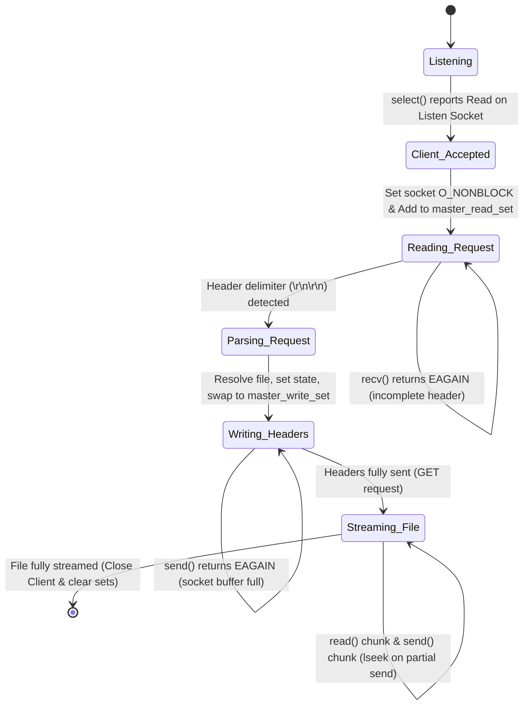

# HTTP Server Evolution: Version 4 (Single-Process I/O Multiplexing with `select`)

This document covers the implementation details, systems programming paradigms, and interview talking points for the **Single-Process Async I/O Multiplexed HTTP Server** (v4) using `select()`. It focuses on non-blocking socket states, event loops, partial-write handling, and I/O scalability limits.

---

## 1. Architectural Overview & Event Loop Flow

In Version 4, the server abandons the multi-process model (with its heavy fork/context-switch overhead) in favor of a single-process event loop. It manages concurrency by setting sockets to non-blocking mode and using `select()` to multiplex I/O. The server tracks each client's progress using a dedicated connection state machine.



---

## 2. Key Code Implementation & Explanations

### A. Setting Sockets to Non-Blocking Mode (`src/main.c`)
```c
int flags = fcntl(client_fd, F_GETFL, 0);
if (flags == -1) {
    perror("fcntl F_GETFL");
    close(client_fd);
    continue;
}
if (fcntl(client_fd, F_SETFL, flags | O_NONBLOCK) == -1) {
    perror("fcntl F_SETFL");
    close(client_fd);
    continue;
}
```

### B. The `select()` Event Loop (`src/main.c`)
```c
fd_set master_read_set, master_write_set, read_set, write_set;
FD_ZERO(&master_read_set);
FD_ZERO(&master_write_set);
FD_SET(listen_fd, &master_read_set);
int max_fd = listen_fd;

while (1) {
    read_set = master_read_set;   // Copy sets because select modifies them in-place
    write_set = master_write_set;
    
    if (select(max_fd + 1, &read_set, &write_set, NULL, NULL) < 0) {
        if (errno == EINTR) continue;
        perror("select");
        break;
    }
    
    for (int fd = 0; fd <= max_fd; fd++) {
        if (FD_ISSET(fd, &read_set)) {
            if (fd == listen_fd) {
                // Accept client, set O_NONBLOCK, and add to master_read_set
            } else {
                // Non-blocking recv() into client state buffer
                // If header found, call http_process_request(), then:
                // FD_CLR(fd, &master_read_set); FD_SET(fd, &master_write_set);
            }
        }
        if (FD_ISSET(fd, &write_set)) {
            // Write headers, then stream file non-blockingly
        }
    }
}
```

### C. Non-Blocking File Streaming & Offset Recovery (`src/main.c`)
```c
if (c->file_fd >= 0 && c->file_sent < c->file_size) {
    char file_buf[FILE_BUFFER_SIZE];
    ssize_t r = read(c->file_fd, file_buf, sizeof(file_buf));
    if (r > 0) {
        ssize_t s = send(fd, file_buf, (size_t)r, 0);
        if (s > 0) {
            c->file_sent += (size_t)s;
            // If socket didn't accept all read bytes, roll back file pointer
            if (s < r) {
                lseek(c->file_fd, s - r, SEEK_CUR);
            }
        } else if (s < 0 && errno != EAGAIN && errno != EWOULDBLOCK) {
            close_client(fd, &master_read_set, &master_write_set);
        }
    } else {
        close_client(fd, &master_read_set, &master_write_set); // EOF or error
    }
}
```

---

## 3. Client State Lifecycle Table

The lifecycle transitions of the `Client` structure can be modeled as follows:

| Current State | Event Trigger | Next State | Action / Syscall |
| :--- | :--- | :--- | :--- |
| **INIT** | Connection Accepted | **READ_REQUEST** | Allocate struct, register read set, set `O_NONBLOCK` |
| **READ_REQUEST**| Receive partial bytes | **READ_REQUEST** | `recv()` returns data, wait for double CRLF `\r\n\r\n` |
| **READ_REQUEST**| Complete headers read | **WRITE_HEADERS**| Clear read set, register write set, parse request |
| **WRITE_HEADERS**| Send partial headers | **WRITE_HEADERS**| `send()` writes partial buffer, update `response_sent` |
| **WRITE_HEADERS**| Headers fully sent | **SEND_BODY** | Check if file transfer (GET) needed; else close client |
| **SEND_BODY** | File read & partial send | **SEND_BODY** | `read()` chunk, `send()`, invoke `lseek()` on partial send |
| **SEND_BODY** | Final chunk sent | **CLOSED** | Close socket and file descriptors, clear master sets |

---

## 4. Core Concepts & Low-Level Mechanics

### A. Non-Blocking Sockets & System Call Behavior
By default, sockets are blocking: if no data is available, `recv()` suspends the thread. If the TCP send buffer is full, `send()` blocks. Setting `O_NONBLOCK` overrides this. When I/O cannot be performed immediately, the system calls fail, return `-1`, and set `errno` to `EAGAIN` or `EWOULDBLOCK`. The application must catch this, retain its current state, and retry the operation once the socket becomes ready.

### B. The Mechanics of `select()`
Under the hood, `select()` works by registering the calling process onto the wait queues of all the device drivers/sockets specified in the bitmasks. The kernel sleeps until one of the descriptors triggers an event (e.g. data arrives, send buffer clears). When awakened, `select()` scans the entire range of file descriptors to populate the output bitmasks and returns control to user space.

---

## 5. Key Systems Interview Questions & Answers

### Q1: What is the purpose of `lseek()` inside the file streaming loop?
**Answer:**
In a non-blocking server, we read `r` bytes from a static file and attempt to send them over a non-blocking socket using `send()`. If the socket's write buffer is nearly full, `send()` will perform a partial write, sending only `s` bytes (where `s < r`) and returning `s`. Since we cannot block to send the remaining `r - s` bytes, we must discard them from our temporary buffer and wait for the next `select()` write readiness event. To ensure the unsent `r - s` bytes are read again next time, we use `lseek(fd, s - r, SEEK_CUR)` to seek backward in the file by exactly the amount that was read but not sent.

### Q2: Why is the state array structure `Client clients[FD_SETSIZE]` indexed by file descriptor?
**Answer:**
Using the socket file descriptor integer as the direct array index guarantees $O(1)$ lookup complexity when dispatching events. When `select()` returns readiness for descriptor `fd`, we instantly access its persistent session state (buffers, read offsets, file offsets) with `&clients[fd]`. This avoids linear searches through list structures, keeping event dispatching as fast as possible.

### Q3: What is `FD_SETSIZE`, and why is it a severe limitation?
**Answer:**
`FD_SETSIZE` is a compile-time constant (typically 1024 on macOS/Linux) that defines the maximum size of the `fd_set` bitmask structures. This places a hard ceiling on the maximum file descriptor value that `select()` can monitor. If a server receives a high volume of connections such that a new client socket is allocated descriptor 1025, attempting to call `FD_SET` on it will cause buffer overflow and memory corruption, crashing the program.

### Q4: Why does `select()` scale poorly as the connection count grows?
**Answer:**
`select()` has two main performance bottlenecks:
1. **User-to-Kernel Copying:** The fd sets are modified in-place by the kernel to return readiness. Consequently, the application must reconstruct and copy the sets from user space to kernel space on every single `select()` invocation. This overhead scales linearly $O(N)$ with the number of monitored descriptors.
2. **Linear Scanning:** Both the kernel and the user-space application must linearly scan all descriptors from 0 up to `max_fd` to check which ones are active or ready. Under high concurrency, the cost of iterating over thousands of idle connections degrades CPU performance.

### Q5: Why is standard file read I/O still blocking in an asynchronous event loop?
**Answer:**
Unlike network sockets, regular files on disk are generally not supportable by standard I/O multiplexers (`select`, `poll`, `epoll`) in non-blocking mode. Calling `read()` on a regular file descriptor will block the entire process if the requested file pages are not already cached in memory (page cache). To achieve true non-blocking file I/O, developers must use POSIX Asynchronous I/O (`aio_read()`) or modern kernels mechanisms like Linux's `io_uring`.

### Q6: What are "Half-Open Connections" and "Socket Starvation" in multiplexed loops?
**Answer:**
* **Half-Open Connection:** Occurs when a client shuts down its writing end (sends a `FIN`), but the server leaves the socket open. The socket registers as ready to read, but `recv()` returns 0 (EOF) repeatedly, causing busy loops unless the server explicitly closes it.
* **Socket Starvation:** Occurs when one fast client performs continuous I/O, causing the loop to always service that client first and starving others. This is prevented by introducing round-robin servicing or queue boundaries.

### Q7: Explain Level-Triggered (LT) vs Edge-Triggered (ET) event notification.
**Answer:**
* **Level-Triggered (LT):** The kernel notifies the application of readiness as long as the underlying event condition remains true (e.g. there is data in the read buffer). `select()` and `poll()` are exclusively level-triggered. If you read only half of the incoming buffer, `select()` will immediately notify you again on the next call.
* **Edge-Triggered (ET):** The kernel notifies the application only when a state transition occurs (e.g. when new data arrives on a socket that was empty). `epoll` supports ET mode. Under ET, if you don't drain the read buffer entirely (reading until `EAGAIN`), the kernel will not notify you again even if data remains, risking connection deadlocks.

### Q8: What happens if a client terminates the connection while the server is writing?
**Answer:**
If a client abruptly aborts the connection (e.g. closing their browser or pressing stop), the TCP socket is torn down. If the server tries to write to this broken socket using `send()`, the first write may return a partial result or fail with `EPIPE` / `ECONNRESET`. If the server ignores this and writes again, the kernel sends a `SIGPIPE` signal to the process. By default, `SIGPIPE` terminates the process. To prevent this crash, the server must ignore `SIGPIPE` globally using `signal(SIGPIPE, SIG_IGN)` and handle the error returns (`-1` with `errno == EPIPE`) by closing the descriptor and freeing resources.

---

## 6. Timeouts, Keep-Alive, and Slowloris Mitigation

In a single-process server, security against slow connections is critical:
* **Slowloris Attacks:** A client initiates a connection but sends the request headers extremely slowly (e.g., 1 byte every 10 seconds) or never sends the trailing double CRLF `\r\n\r\n`. In a blocking or simple asynchronous server, this connection would hang open forever, occupying a slot in the limited socket array.
* **Timeout Implementation:** To prevent resource exhaustion, the event loop tracks the timestamp of the last active operation for each file descriptor. A heartbeat scanner periodically iterates through the active client array and terminates connections that have been idle longer than a defined threshold (e.g., 15 seconds).
* **HTTP Keep-Alive:** To support Keep-Alive, once a response is fully written, the server must not close the socket. Instead, it resets the client state variables (`received`, `response_sent`, etc.), removes the socket from `master_write_set`, and registers it back in `master_read_set`, restarting the read cycle.

---

## 7. Architectural Evaluation (Pros & Cons)

| Feature / Metric | Single-Process `select` (v4) | Multi-Process (v3) |
| :--- | :--- | :--- |
| **Fault Isolation** | **Poor.** A crash or memory corruption anywhere in the process destroys all active client sessions. | **Excellent.** A child crash is isolated and cannot affect other workers. |
| **State Sharing** | **Extremely Simple.** All connection states reside in the same address space. No IPC is needed. | **Difficult.** Requires shared memory or process pipes. |
| **Resource Efficiency**| **Excellent.** Consumes minimal memory and runs on a single thread. Zero fork overhead. | **Very Low.** High memory usage and scheduler thrashing under load. |
| **Maximum Connections**| **Limited.** Hardcapped by `FD_SETSIZE` (usually 1024 connections). | **Limited.** Hardcapped by system process limits (`RLIMIT_NPROC`). |
| **Code Complexity** | **High.** Requires implementing an explicit state machine and managing partial I/O. | **Low.** Linear, synchronous code path. |

---

## 8. Scaling Limits and Next Evolution Steps

While Version 4 improves efficiency by eliminating process fork overhead, the transition to `select()` introduces severe scaling ceilings:
1. **Linear Scalability Trap:** Time complexity for event scanning is $O(\text{max\_fd})$, meaning idle connections actively consume CPU cycles.
2. **Bitmask Limits:** The hardcoded `FD_SETSIZE` limit prevents scaling beyond 1024 clients.
3. **The Next Step:** Evolving to `poll()` relaxes the descriptor value limit by using dynamically allocated arrays of `struct pollfd` instead of fixed-size bitmasks. However, `poll()` still suffers from $O(N)$ linear scans in kernel space. True scalability ($O(1)$ scaling) is achieved only by moving to event-driven APIs like Linux `epoll` or macOS `kqueue`.

---

## 9. Compilation & Testing Quick Start

To compile and verify the multiplexed server implementation under v4, use the following commands in the workspace root:

```bash
# 1. Compile the server
gcc -g -Wall -Wextra -Wpedantic -Iinclude src/*.c -o mini_http_select

# 2. Run the compiled binary
./mini_http_select

# 3. Verify server availability and concurrent capability
curl -i http://localhost:8080/
```
