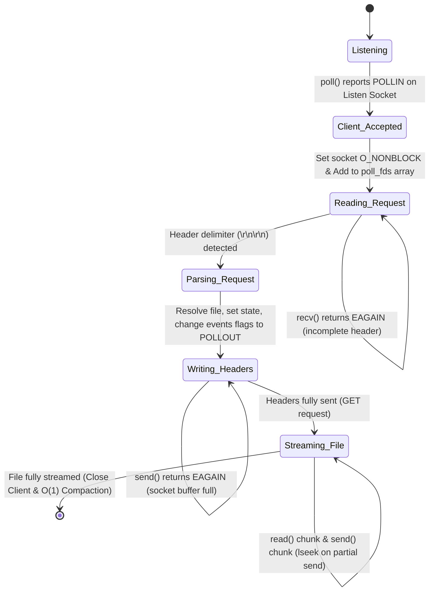

# HTTP Server Evolution: Version 5 (Single-Process I/O Multiplexing with `poll`)

This document covers the implementation details, systems programming paradigms, and interview talking points for the **Single-Process Async I/O Multiplexed HTTP Server** (v5) using `poll()`. It focuses on dynamic connection arrays, array compaction, and event flag transitions, comparing the flow with `select()` and `epoll()`.

---

## 1. Architectural Overview & Event Loop Flow

In Version 5, the server uses a single-process event loop driven by the `poll()` system call. Instead of managing fixed-size bitmasks like `select()`, it maintains a contiguous array of `struct pollfd` structures. Sockets are set to non-blocking mode, and connection states are tracked using the socket file descriptor as a direct index into the `clients` state array.



---

## 2. Key Code Implementation & Explanations

### A. The `poll()` Event Loop & Connection Handling (`src/main.c`)
```c
struct pollfd poll_fds[FD_SETSIZE];
static Client clients[FD_SETSIZE];

// In main():
int listen_fd = server_get_listen_fd(server);
int poll_count = 0;

poll_fds[0].fd = listen_fd;
poll_fds[0].events = POLLIN;
poll_fds[0].revents = 0;
poll_count = 1;

while (1) {
    int ready = poll(poll_fds, poll_count, -1);
    if (ready < 0) {
        if (errno == EINTR) continue;
        perror("poll");
        break;
    }
    
    for (int i = 0; i < poll_count; i++) {
        if (poll_fds[i].revents == 0) continue;
        
        int fd = poll_fds[i].fd;
        
        if (poll_fds[i].revents & POLLIN) {
            if (fd == listen_fd) {
                // Accept client, set non-blocking, and append to poll_fds
                // poll_fds[poll_count].fd = client_fd;
                // poll_fds[poll_count].events = POLLIN;
                // poll_count++;
            } else {
                // recv() request data non-blockingly
                // If header fully received, process and switch client state to POLLOUT:
                // poll_fds[i].events = POLLOUT;
            }
        }
        if (poll_fds[i].revents & POLLOUT) {
            // Send headers, stream file, and cleanup client when done
        }
    }
}
```

### B. O(1) Unordered Connection Array Compaction (`src/main.c`)
To avoid $O(N)$ overhead when removing an inactive connection (which would require shifting all subsequent array elements to maintain order), we swap the target descriptor with the last active element in the `poll_fds` array and decrement `poll_count`.

```c
static void remove_client(int index, int *poll_count) {
    int fd = poll_fds[index].fd;
    if (clients[fd].file_fd >= 0) {
        close(clients[fd].file_fd);
    }
    close(fd);
    clients[fd] = (Client){0};
    clients[fd].file_fd = -1;
    
    // Swap target element with the last element in the array
    poll_fds[index] = poll_fds[*poll_count - 1];
    (*poll_count)--;
}
```

---

## 3. High-Level Comparison: `select` vs `poll` vs `epoll`

The progression of I/O multiplexing in POSIX/Linux systems addresses scaling limits by shifting how file descriptors (FDs) are tracked and monitored by the kernel.

### A. The Conceptual Flow

```
select()
    ↓
give kernel all FDs (bitmasks from 0 to max_fd)
    ↓
kernel checks them
    ↓
you scan them (linear search from 0 to max_fd in user space)

poll()
    ↓
give kernel array of FDs (only active descriptors)
    ↓
kernel checks them
    ↓
you scan the array (linear search up to active connection count)

epoll()
    ↓
register FDs with kernel (via epoll_ctl once)
    ↓
kernel maintains interest set (persistent tree in kernel space)
    ↓
ask only for ready FDs (via epoll_wait)
    ↓
process returned ready events (no scanning of inactive FDs)
```

### B. Detailed Comparison Table

| Feature / Metric | `select()` | `poll()` | `epoll()` |
| :--- | :--- | :--- | :--- |
| **FD Data Structure** | Fixed-size bitmasks (`fd_set`) | Array of `struct pollfd` | Kernel-space Red-Black Tree & Ready List |
| **Connection Limit** | Hardcapped by `FD_SETSIZE` (usually 1024) | Unlimited (bounded only by system limits / RAM) | Unlimited (bounded only by system limits / RAM) |
| **User-to-Kernel Copy** | Copies entire set on *every* call ($O(N)$) | Copies entire array on *every* call ($O(N)$) | Registered once ($O(1)$ during wait) |
| **Kernel Search Cost** | Scans from 0 to `max_fd` ($O(N)$) | Scans input array ($O(N)$) | Checks ready list ($O(\text{ready\_fds})$ or $O(1)$) |
| **User Search Cost** | Loops over 0 to `max_fd` check (`FD_ISSET`) | Loops over active descriptors array | Direct loop over ready event array |
| **Trigger Modes** | Level-Triggered (LT) only | Level-Triggered (LT) only | Level-Triggered (LT) & Edge-Triggered (ET) |

---

## 4. Client State Lifecycle Table

The lifecycle transitions of the `Client` structure under `poll()` focus on swapping the registered interest flags in the `poll_fds` array:

| Current State | Event Trigger | Next State | Action / Syscall |
| :--- | :--- | :--- | :--- |
| **INIT** | Connection Accepted | **READ_REQUEST** | Allocate struct, register `POLLIN` in `poll_fds`, set socket `O_NONBLOCK` |
| **READ_REQUEST**| Receive partial bytes | **READ_REQUEST** | `recv()` returns data, wait for double CRLF `\r\n\r\n` |
| **READ_REQUEST**| Complete headers read | **WRITE_HEADERS**| Switch events flag to `POLLOUT` on the client's `pollfd` slot, parse request |
| **WRITE_HEADERS**| Send partial headers | **WRITE_HEADERS**| `send()` writes partial buffer, update `response_sent` |
| **WRITE_HEADERS**| Headers fully sent | **SEND_BODY** | Check if file transfer (GET) needed; else call `remove_client()` |
| **SEND_BODY** | File read & partial send | **SEND_BODY** | `read()` chunk, `send()`, invoke `lseek()` on partial send |
| **SEND_BODY** | Final chunk sent | **CLOSED** | Close socket and file descriptors, perform $O(1)$ `poll_fds` swap-back compaction |

---

## 5. Core Concepts & Low-Level Mechanics

### A. The Struct `pollfd` Representation
Unlike `select()` which uses destructive in-place bitmask modification (requiring the user to rebuild the sets before every call), `poll()` separates input interest from output results:
```c
struct pollfd {
    int   fd;         /* file descriptor to monitor */
    short events;     /* requested events bitmask (input) */
    short revents;    /* returned events bitmask (output) */
};
```
The application sets the `events` field (e.g., `POLLIN`, `POLLOUT`, `POLLERR`). The kernel writes the result into `revents`. This means the `events` field remains intact and does not need to be reinitialized before each `poll()` invocation.

### B. Array Compaction vs Loop Variable Adjustments
Because `remove_client` swaps the deleted element with the last element in `poll_fds`, the element previously at the end of the array is moved to index `i`. To avoid skipping the verification of this swapped-in descriptor, we must decrement the loop counter `i` (`i--`) immediately after calling `remove_client` (or after inlining the swap). This ensures the next iteration processes the newly swapped-in client.

---

## 6. Key Systems Interview Questions & Answers

### Q1: How does `poll()` resolve the scaling bottleneck of `select()` related to file descriptor numbers?
**Answer:**
`select()` is limited by the compile-time `FD_SETSIZE` constant (typically 1024), which defines the size of the bitmask. If a socket descriptor exceeds 1023, it cannot be monitored. `poll()` does not use bitmasks; it takes an array of `struct pollfd`. The size of this array is dynamic and is limited only by the process's open file limit (`RLIMIT_NOFILE`) and system memory. This allows `poll()` to monitor descriptors with values larger than 1024 without issues.

### Q2: Why is the separation of `events` and `revents` in `struct pollfd` a design improvement over `select()`?
**Answer:**
In `select()`, the read/write/error `fd_set` bitmasks are input-output parameters; the kernel overwrites the user's input to indicate readiness. Therefore, the application must completely rebuild the bitmasks before every `select()` call. In `poll()`, the requested events (`events`) are separated from the returned events (`revents`). The kernel only modifies `revents`, allowing the program to reuse the same array across loop iterations without reconstruction.

### Q3: Explain why `poll()` still scales poorly ($O(N)$) under a high number of concurrent connections.
**Answer:**
Although `poll()` bypasses `FD_SETSIZE`, it still suffers from two major limitations:
1. **User-Kernel Copying:** The array of `struct pollfd` must be copied from user space to kernel space on every call to `poll()`. As connection counts scale to thousands, this copying overhead becomes expensive.
2. **Linear Kernel Scan:** The kernel must check each file descriptor in the passed array to see if any events are pending.
3. **Linear User Scan:** Once `poll()` returns, the application must iterate through the array to check which elements have non-zero `revents`. If only a few descriptors are active out of thousands of connections, the application wastes CPU cycles scanning idle descriptors.

### Q4: Detail the mechanics and safety considerations of the $O(1)$ unordered array compaction.
**Answer:**
When a connection is closed, its slot in `poll_fds` is vacated. Shifting elements to maintain order is an $O(N)$ operation. To optimize this to $O(1)$, we replace the closed connection's `pollfd` struct with the last `pollfd` in the array and decrement the active element count.
* **Safety Consideration:** The swapped-in element is now at the current index `i`. If we simply continue the loop, the next iteration will increment to `i + 1`, and the swapped-in descriptor will not be checked during this cycle. Decrementing the loop index (`i--`) ensures the swapped element is evaluated immediately in the next iteration.

### Q5: How do we handle transitions between reading request headers and writing response bodies in `poll()`?
**Answer:**
We begin by monitoring the socket for read readiness using `POLLIN`. Once we receive the complete HTTP headers (signaled by `\r\n\r\n`), we process the request (e.g., opening the requested file). To start sending the response without blocking, we switch the socket's interest by assigning `poll_fds[i].events = POLLOUT`. This notifies us when the socket's write buffer is ready to accept data, allowing us to send the headers and stream the file.

---

## 7. Architectural Evaluation (Pros & Cons)

| Feature / Metric | Single-Process `poll` (v5) | Single-Process `select` (v4) |
| :--- | :--- | :--- |
| **FD Value Ceiling** | **No Limit.** Monitored FDs can exceed 1024. | **Hard Limit.** FDs must be $< 1024$ (`FD_SETSIZE`). |
| **Initialization Cost**| **Low.** Reuse same `poll_fds` array without rebuild. | **High.** Must rebuild `fd_set` bitmasks every iteration. |
| **Memory Management** | **Dynamic.** Size of connection list can adjust dynamically. | **Static.** Fixed structure sized by compile-time parameters. |
| **User/Kernel Search** | **Linear ($O(N)$).** Scans active descriptor array. | **Linear ($O(N)$).** Scans all FDs up to `max_fd`. |
| **Complexity** | **High.** Requires managing array indexes, swap-back. | **Medium.** Straightforward loop up to `max_fd`. |

---

## 8. Compilation & Testing Quick Start

To compile and verify the multiplexed server implementation under v5, use the following commands in the workspace root:

```bash
# 1. Compile the server
gcc -g -Wall -Wextra -Wpedantic -Iinclude src/*.c -o mini_http_poll

# 2. Run the compiled binary
./mini_http_poll

# 3. Verify server availability and concurrent capability
curl -i http://localhost:8080/
```
